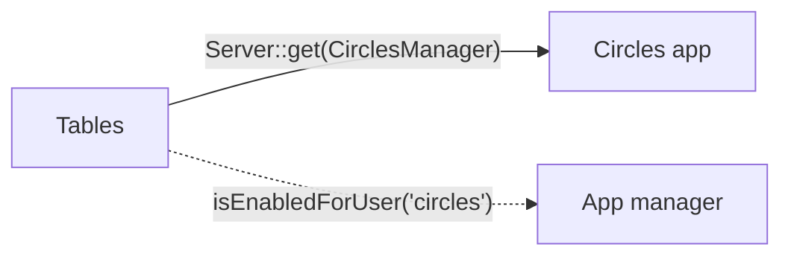
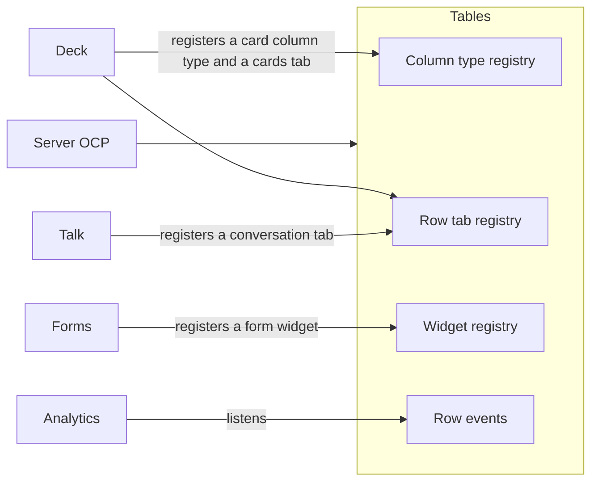
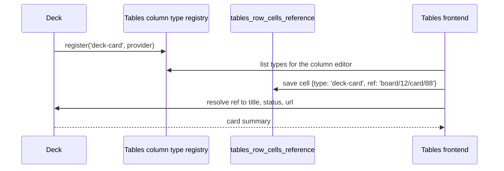

<!--
  - SPDX-FileCopyrightText: 2026 Conduction B.V.
  - SPDX-License-Identifier: AGPL-3.0-or-later
-->
# Kick-off agenda

Part of the [buildiq parity project](README.md). For the first meeting between Conduction and Nextcloud GmbH about this plan. Ninety minutes. Outcomes wanted: answers to the open questions marked here, agreement on the integration direction, and a date for the first sprint review.

## 1. The integration direction, 30 minutes

The one architectural decision that shapes everything else. Today Tables reaches teams by calling Circles classes directly, behind an enabled check:

That works because Circles is bundled, and it is the pattern this project must not repeat for Deck, Talk, Collectives, Forms, Polls, Maps, Photos, Mail or anything else. The alternative is the Flow model: the hosting app publishes extension points, the integrating app registers into them, and the hosting app depends on nothing.

Questions for the room:

- Does Tables publish these three registries and keep its row events as the fourth extension point?
- Does Tables itself move from `OCA\Circles` to `OCP\Teams`?
- What is the contract of a column type provider: storage in a Tables cell table, or the app's own storage with a reference cell?
- Who writes the first external provider as the reference implementation? Deck is the obvious candidate.

A provider contract, for discussion:

Outcome wanted: yes or no on the registries, and the answer to question Q2.

## 2. The rows API and slugs, 15 minutes

- The second rows API: search, filter, sort, paging with total, fields, `format=object`. Parameter names follow Tables conventions. Is `api/2` the right home?
- Slugs on tables, so a default CRUD API exists per application and table: `/api/2/apps/{application}/{table}`. Views and applications already carry slugs on the fork; tables do not.
- Everything regenerates into `openapi.json`. Does Nextcloud want a served documentation page for it, or stays the file the documentation?

## 3. Types and formats, 15 minutes

- The new column types: json, file, array, tag, calendar item, contact. See [types and formats](10-types-and-formats.md).
- `format` on columns, folding in the current regex pattern.
- Backwards compatibility rule D12.

## 4. May an application assume Tables, 10 minutes

Question Q1. A generated application declares Tables as a dependency. Acceptable?

## 5. User reviews, 10 minutes

Question Q7. Monthly online sessions from December with organisations that build on Tables. Does Nextcloud have contacts to invite? Is Conduction hosting acceptable?

## 6. Working agreement, 10 minutes

- Sprint reviews every two weeks, who attends from Nextcloud.
- Upstream review turnaround on the fork's pull requests, starting with the grid and app shell pull request.
- Where the project documents live after the kick-off: this folder in nextcloud/tables, or a wiki.
